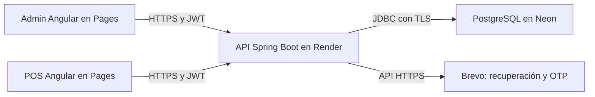

# Arquitectura y guía para el equipo

El sistema tiene dos aplicaciones Angular que consumen una misma API Spring Boot.
Solo el backend accede a PostgreSQL y envía correos. Los servicios cloud funcionan
sin mantener encendida la computadora de ningún integrante.

## Acceso a las aplicaciones

| Servicio | Dirección | Uso |
|---|---|---|
| Admin | [Abrir Admin](https://restaurante-admin-ayd1.pages.dev/auth/login) | Administración; login comprobado después de CD |
| POS | [Abrir POS](https://restaurante-pos-ayd1.pages.dev/auth/login) | Operación; requiere un rol operativo |
| API | [URL base](https://restaurant-proyecto1-ayd1.onrender.com/api/v1) | Prefijo de endpoints; no es una página de inicio |
| Documentación API | [Swagger](https://restaurant-proyecto1-ayd1.onrender.com/api/v1/swagger-ui.html) | Consultar contratos; ejecutar una operación puede modificar datos reales |
| Salud | [Readiness](https://restaurant-proyecto1-ayd1.onrender.com/api/v1/actuator/health/readiness) | Comprobar estado de arranque |
| Código y revisiones | [Repositorio](https://github.com/KennySalazar/restaurant-proyecto1-ayd1) | Código, pull requests y Actions |

El POS admite WAITER, KITCHEN y CASHIER. Un ADMIN puede iniciar sesión y recibir
`/unauthorized` al entrar al POS: es la restricción de rol. La creación y prueba de una
cuenta operativa quedó pospuesta; todavía no se confirmó el recorrido completo del POS.

## Cómo se conectan las partes

- **Cloudflare Pages** entrega las pantallas compiladas de Admin y POS.
- **Render** ejecuta el backend Docker: seguridad, reglas de negocio y acceso a datos.
- **Neon** conserva la base compartida; los frontend nunca se conectan directamente a ella.
- **Brevo** envía los correos desde el backend con un remitente verificado.
- **GitHub Actions** prueba el código y publica las versiones aprobadas.
- **Cloudinary** se agregará al desarrollar las imágenes de platillos; aún no forma parte del flujo activo.

JWT identifica la sesión y los roles limitan el acceso. CORS permite las llamadas desde
los dos orígenes de Pages configurados; no sustituye la autorización del backend.
Las URL de producción son públicas, pero las operaciones protegidas necesitan sesión.

## Cómo trabajar y publicar cambios

1. Partir de `develop` actualizado y trabajar en una rama `feature/*`.
2. Probar localmente y abrir un PR hacia `develop`. Actions comprueba backend,
   PostgreSQL, ambos frontend y automatización. El PR no publica producción.
3. Revisar el código y esperar `CI aprobada` antes de fusionar con autorización del equipo.
4. Preparar una rama `release/*` desde develop y un PR hacia `main` para una entrega.
5. Al fusionar en main, Actions vuelve a probar y despliega Render, Admin y POS si todo aprueba.
6. Revisar también **Desplegar producción** y probar la aplicación; CI aprobada por sí
   sola no confirma que se haya publicado.

No hacer push directo a main ni subir ZIP manualmente como procedimiento habitual.
CD está activa: incluso un cambio documental en main ejecuta la publicación.
Las protecciones obligatorias de ramas aún deben comprobarse en Settings; estas
reglas de trabajo no equivalen a una protección técnica ya instalada.

Si falla una publicación, avisar al responsable con el enlace de Actions y el nombre
del paso. Consultar [la guía técnica](CONFIGURACION-DESPLIEGUE.md) antes de reintentar.
Un fallo tardío puede dejar algunos servicios actualizados y otros en la versión anterior.

## Desarrollo local y producción

| Componente | Desarrollo local | Producción |
|---|---|---|
| Admin | Puerto 4200 | Pages Admin |
| POS | Puerto 4201 | Pages POS |
| API | Puerto 8090, perfil dev | Render, perfil prod y puerto del proveedor |
| Base | PostgreSQL Docker, puerto externo 5437 | Neon |
| Acceso del frontend a API | `/api/v1` con proxy local | URL HTTPS de Render terminada en `/api/v1` |

Instalar y arrancar siguiendo los README de [API](../restaurante-api/README.md),
[Admin](../restaurante-admin/README.md) y [POS](../restaurante-pos/README.md).
Usar `npm ci` después de actualizar los lockfiles. El backend local requiere sus
variables y PostgreSQL; no configurar Neon de producción para pruebas de desarrollo.
PostgreSQL 18 local monta el volumen en `/var/lib/postgresql`.

Las nuevas estructuras de base se agregan como nuevas migraciones Flyway. Nunca
editar una migración aplicada ni borrar datos cloud para resolver una prueba local.
Los secretos permanecen en `.env` local o en los paneles autorizados; no van a Angular,
README, issues, capturas ni commits.
